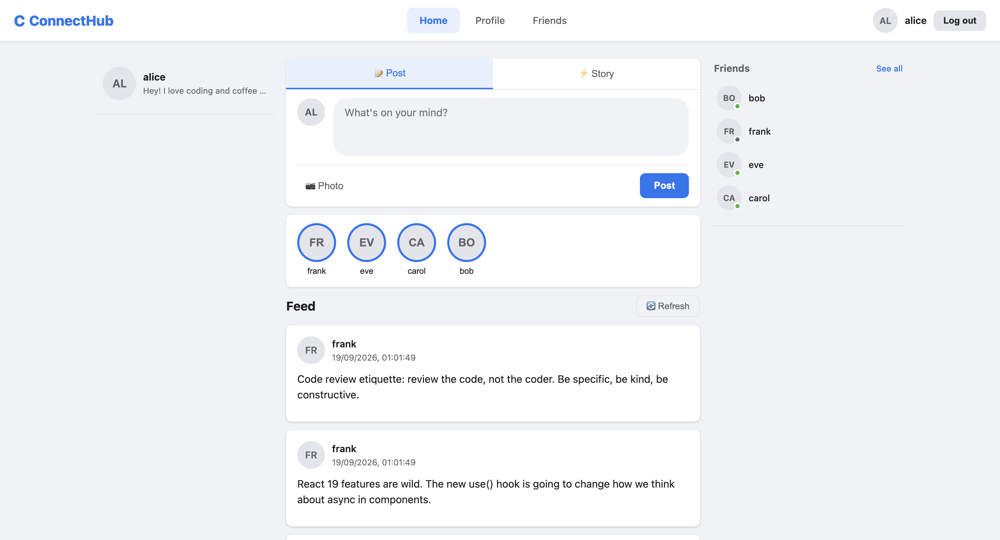
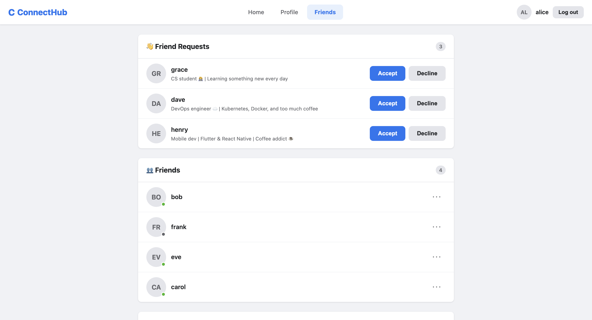
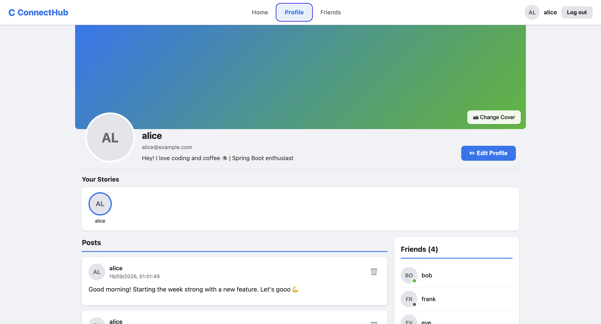
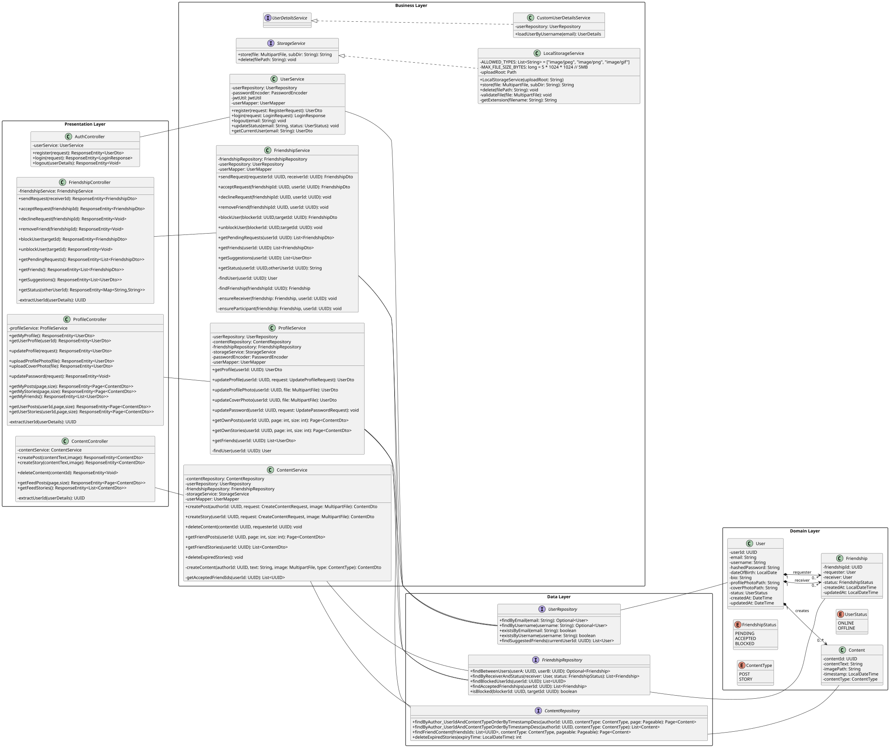
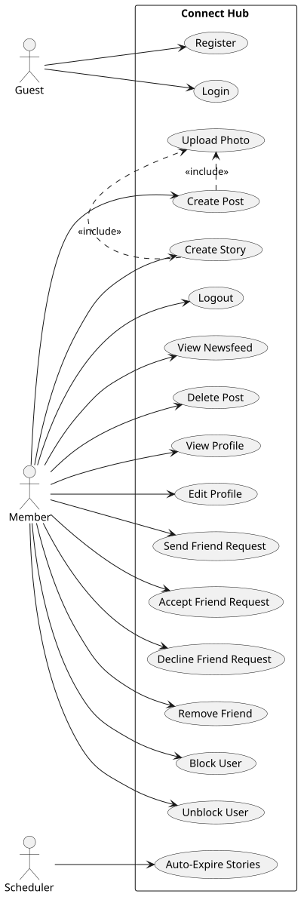
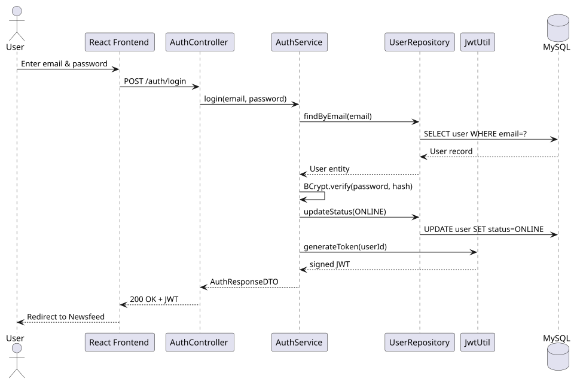
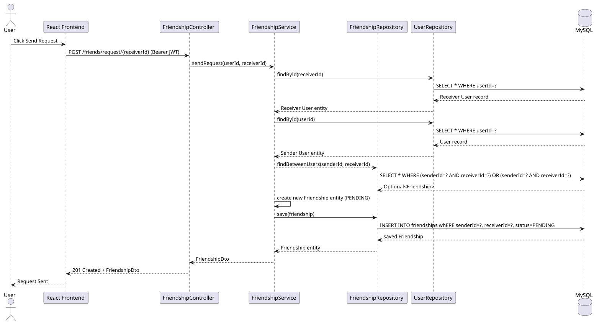
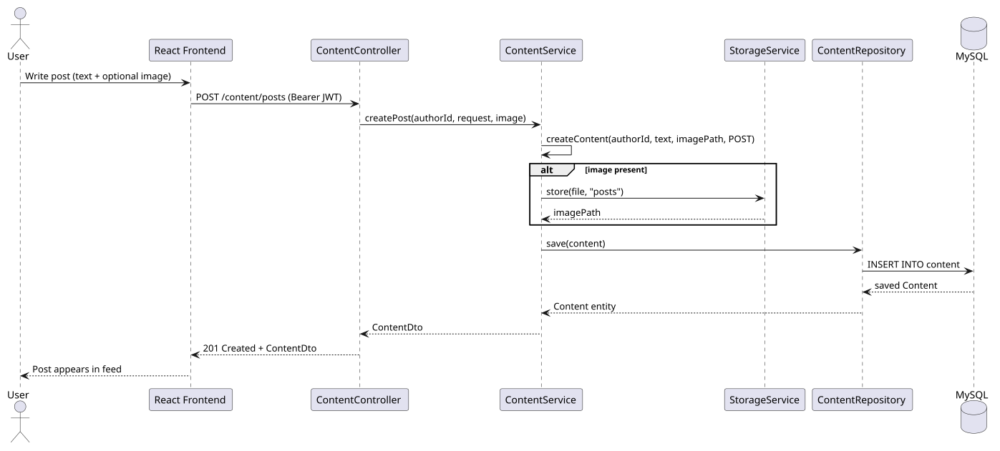

# ConnectHub — Social Networking Platform


A full-stack social networking web application built with **Spring Boot** and **React**.
Originally implemented as a desktop application in **pure Java with Swing** and a
file-based JSON database, then re-architected to a modern web stack — replacing Swing
with React, file storage with MySQL, and adding a REST API layer with JWT authentication.

## Related Repositories

- Web version (current): https://github.com/sh-toqa/connect-hub
- Desktop Java Swing version: https://github.com/sh-toqa/Lab9-ConnectHub.git

---

## Live Demo

**App:** https://connect-hub-three-sepia.vercel.app
**API:** https://connect-hub-production-9c68.up.railway.app

| Demo account | Password |
|---|---|
| `demo@connecthub.dev` | `password123` |

Logging in as `demo` shows an account with existing friends, a pending
friend request, a blocked user, and a small post history — or register a
new account to try the signup flow yourself.

> First request after a period of inactivity can take ~30–60s: the backend
> runs on a free hosting tier that spins down when idle. That's a
> hosting-tier tradeoff, not a bug — see [Deployment](#deployment) below.

### Screenshots

| Feed | Friends |
|---|---|
|  |  |

**Profile**


---

## Features

- **User Authentication** — JWT-based register, login, logout with BCrypt password hashing
- **Profile Management** — Edit bio, upload profile photo and cover photo, change password
- **Posts & Stories** — Create text/image posts (permanent) and stories (auto-expire after 24h)
- **Newsfeed** — Three-column layout showing friend posts, active stories, and suggestions
- **Friend Management** — Send/accept/decline friend requests, remove friends, block users
- **Online/Offline Status** — Real-time friend status visible across all pages
- **Content Viewer** — Click any post or story to open a full-screen modal
- **User Profiles** — Click any username to visit their public profile

---

## Tech Stack

### Backend
| Technology | Purpose |
|---|---|
| Java 17 + Spring Boot 3 | REST API framework |
| Spring Security + JWT | Authentication & authorization |
| Spring Data JPA + Hibernate | ORM and database access |
| MySQL | Primary database |
| Flyway | Versioned production schema migrations |
| H2 (in-memory) | Test database |
| BCrypt | Password hashing |
| Maven | Build tool |
| Docker | Multi-stage, non-root container image |

### Frontend
| Technology | Purpose |
|---|---|
| React 19 | UI framework |
| React Router v6 | Client-side routing |
| Axios | HTTP client |
| Vite | Build tool & dev server |
| Vitest + Testing Library | Frontend testing |

### Testing
| Tool | Purpose |
|---|---|
| JUnit 5 | Unit & integration tests |
| Mockito | Mocking dependencies |
| MockMvc | HTTP layer testing |
| Vitest | Frontend unit tests |
| axios-mock-adapter | API mocking |

---

## Architecture

The project follows a strict **layered architecture**:

```
React SPA (port 5173)
      ↕  HTTP/JSON
Spring Boot REST API (port 8080)
      ↕
MySQL Database
```

### Backend layers
```
Controller  →  Service  →  Repository  →  Database
```

Each layer has a single responsibility. Controllers handle HTTP, services contain business logic, repositories handle data access. Entities never leave the service layer — only DTOs are returned to controllers.

### Design patterns used
- **Builder** — All entities use Lombok `@Builder`
- **Facade** — Service classes hide multi-repository coordination
- **DTO** — `UserDto`, `ContentDto`, `FriendshipDto` prevent entity exposure
- **Mapper** — `UserMapper` centralises all entity → DTO conversions
- **Strategy** — `StorageService` interface abstracts file storage (swap to S3 without changing any other class)
- **Singleton** — All Spring beans (`@Service`, `@Component`) are singletons
- **Custom Hook** — `useProfile`, `useContent`, `useFriends` encapsulate React state + API calls
- **Context** — `AuthContext` provides global auth state without prop drilling
- **Guard** — `PrivateRoutes` / `PublicRoutes` protect routes based on auth state

---

## Security

- **Authentication** — stateless JWT (HS512), issued on login/register, validated on every protected request by a custom `JwtAuthFilter`
- **Passwords** — BCrypt, strength 10, never logged or included in any response DTO
- **CORS** — restricted to a single, explicitly configured frontend origin (`app.cors.allowed-origin`), not wildcarded
- **Secrets** — the JWT signing key and database credentials are never hardcoded or committed. Every environment (dev/test/prod) resolves them from environment variables, and production has **no default value** for the JWT secret — a missing secret fails startup instead of silently signing tokens with a weak key
- **Transport** — HTTPS end-to-end in production (provided automatically by Vercel and Railway); the database connection itself requires TLS (`sslMode=REQUIRED`)

---

## Project Structure

```
connecthub/
├── backend/
│   ├── src/main/java/org/connecthub/backend/
│   │   ├── controller/        AuthController, ProfileController,
│   │   │                      ContentController, FriendshipController
│   │   ├── service/           AuthService, ProfileService,
│   │   │                      ContentService, FriendshipService,
│   │   │                      CustomUserDetailsService,
│   │   │                      StorageService (interface), LocalStorageService
│   │   ├── repository/        UserRepository, ContentRepository, FriendshipRepository
│   │   ├── model/             User, Content, Friendship
│   │   ├── enums/             ContentType, FriendshipStatus, UserStatus
│   │   ├── dto/
│   │   │   ├── request/       RegisterRequest, LoginRequest, UpdateProfileRequest ...
│   │   │   └── response/      UserDto, ContentDto, FriendshipDto, LoginResponse ...
│   │   ├── mapper/            UserMapper
│   │   ├── security/          SecurityConfig, JwtUtil, JwtAuthFilter
│   │   ├── exception/         GlobalExceptionHandler, ResourceNotFoundException ...
│   │   └── config/            WebMvcConfig, DataSeeder
│   ├── src/main/resources/
│   │   ├── application*.properties   base + dev/prod profile overrides
│   │   └── db/migration/             Flyway migrations (prod schema + demo data)
│   └── src/test/java/
│       ├── Unit/
│       │   ├── service/       ProfileServiceTest, ContentServiceTest,
│       │   │                  FriendshipServiceTest, LocalStorageServiceTest,
│       │   │                  UserServiceTest
│       │   └── controller/    ProfileControllerTest,
│       ├── Integration/       AuthControllerIntegrationTest, ContentControllerIntegrationTest,
│       │                      FriendshipControllerIntegrationTest, ProfileControllerIntegrationTest
│       └── System/            SystemTest
│
└── frontend/
    └── src/
        ├── api/               authApi.js, profileApi.js, contentApi.js, friendApi.js ...
        ├── context/           AuthContext.jsx
        ├── hooks/             useProfile.js, useContent.js, useFriends.js
        ├── pages/             LoginPage, SignupPage, ProfilePage, NewsfeedPage,
        │                      FriendsPage, UserProfilePage, NotFoundPage
        ├── styles/            global.css
        └── components/
            ├── common/        Navbar, AuthLayout
            │                  (route guards - PrivateRoutes/PublicRoutes - live in App.jsx)
            ├── profile/       ProfileAvatar, CoverPhoto, PostCard,
            │                  FriendsList, EditProfileModal
            ├── content/       CreatePostForm, StoryStrip, ContentModal,
            │                  NewsfeedLeftSidebar, NewsfeedRightSidebar
            └── friends/       FriendCard, FriendRequestCard, SuggestionCard
      
```

---

## API Endpoints

### Auth — `/auth`
| Method | Endpoint | Auth | Description |
|---|---|---|---|
| POST | `/register` | Public | Create new account |
| POST | `/login` | Public | Login, returns JWT |
| POST | `/logout` | JWT | Logout, sets status OFFLINE |

### Profile — `/profile`
| Method | Endpoint | Auth | Description |
|---|---|---|---|
| GET | `/` | JWT | Get own profile |
| GET | `/{userId}` | JWT | Get any user's profile |
| PATCH | `/` | JWT | Update bio |
| POST | `/photo` | JWT | Upload profile photo |
| POST | `/cover` | JWT | Upload cover photo |
| PATCH | `/password` | JWT | Change password |
| GET | `/posts` | JWT | Get own posts (paginated) |
| GET | `/friends` | JWT | Get friends list |
| GET | `/stories` | JWT | Get own stories |
| GET | `/{userId}/posts` | JWT | Get another user's posts |
| GET | `/{userId}/stories` | JWT | Get another user's active stories |

### Content — `/content`
| Method | Endpoint | Auth | Description |
|---|---|---|---|
| POST | `/posts` | JWT | Create a post |
| POST | `/stories` | JWT | Create a story |
| DELETE | `/{contentId}` | JWT | Delete own content |
| GET | `/feed/posts` | JWT | Friend posts (paginated) |
| GET | `/feed/stories` | JWT | Active friend stories |

### Friends — `/friends`
| Method | Endpoint | Auth | Description |
|---|---|---|---|
| POST | `/request/{receiverId}` | JWT | Send friend request |
| POST | `/{friendshipId}/accept` | JWT | Accept request |
| DELETE | `/{friendshipId}/decline` | JWT | Decline request |
| DELETE | `/{friendshipId}` | JWT | Remove friend |
| POST | `/block/{targetId}` | JWT | Block user |
| DELETE | `/block/{targetId}` | JWT | Unblock user |
| GET | `/requests` | JWT | Pending received requests |
| GET | `/` | JWT | Accepted friends list |
| GET | `/suggestions` | JWT | Friend suggestions |
| GET | `/status/{otherUserId}` | JWT | Relationship status |

---

## Getting Started

### Prerequisites
- Java 17+
- Node.js 22+
- MySQL 9+
- Maven 3.9+
- Docker (optional, for running the backend in a container)

### Backend setup

```bash
# 1. Clone the repo
git clone https://github.com/sh-toqa/connect-hub.git
cd connecthub/backend

# 2. Create the database
mysql -u root -p -e "CREATE DATABASE connecthub CHARACTER SET utf8mb4 COLLATE utf8mb4_unicode_ci;"

# 3. Configure environment variables
# If backend/.env does NOT already exist, create it from the template
# (it's gitignored, so nothing here ever gets committed):
[ -f .env ] || cp .env.example .env
# If APP_JWT_SECRET in .env is empty, generate a strong one and paste it in:
openssl rand -base64 64
# Fill in SQL_USERNAME / SQL_PASSWORD with your real local MySQL credentials.
# NEVER re-run `cp .env.example .env` once .env has real values in it -
# that will silently overwrite them with the empty placeholders.

# 4. Load the env vars and run with the dev profile active
set -a && source .env && set +a && mvn spring-boot:run -Dspring-boot.run.profiles=dev
# (or paste the contents of .env into your IDE's run configuration
# environment variables field, and set the active profile to "dev")

# API runs at http://localhost:8080
```

All backend config (DB host/port/name, JWT secret, CORS origin, upload
dir, server port) is environment-driven - see `backend/.env.example` for
the full list. Nothing sensitive lives in `application.properties`.

### Running the backend with Docker (optional)

An alternative to the manual Maven setup above - useful for verifying the
app runs the same way it will in production, or if you don't want Maven/JDK
17 installed locally.

```bash
cd connecthub/backend

docker build -t connecthub-backend:local .

docker run -d \
  --name connecthub-backend \
  -p 8080:8080 \
  --env-file .env \
  -e DB_HOST=host.docker.internal \
  -e SPRING_PROFILES_ACTIVE=dev \
  connecthub-backend:local

# API runs at http://localhost:8080
```

`DB_HOST=host.docker.internal` overrides the `.env` value on purpose: inside
a container, `localhost` refers to the container itself, not your Mac where
MySQL is actually running. `host.docker.internal` is Docker Desktop's name
for "the host machine."

Note: uploaded files (profile/cover photos) are written inside the
container's own filesystem and are lost if the container is removed - see
the `app.upload-dir` note in `application.properties` for why.

### Frontend setup

```bash
cd connecthub/frontend

cp .env.example .env
# Edit .env and set VITE_API_BASE_URL to your backend's URL
# (defaults to http://localhost:8080 for local dev)

npm install
npm run dev

# App runs at http://localhost:5173
```

### Development data (optional)

Running with the `dev` profile active (see step 4 above) seeds the database with 8 users, 35 posts, 9 stories, and 12 friendships on every restart - `application-dev.properties` already sets `spring.jpa.hibernate.ddl-auto=create-drop`, and `DataSeeder` runs automatically whenever `dev` is active.

Default credentials for all seeded users: `password123`

---

## Deployment

See [Live Demo](#live-demo) above for the actual links and demo credentials.
This section covers how it's deployed, not how to run it locally.

| Layer | Platform | Why |
|---|---|---|
| Frontend | Vercel | Static Vite build, automatic HTTPS, zero-config SPA hosting |
| Backend | Railway | Builds and runs directly from the repo's `Dockerfile` — the same image tested locally, not a separately-guessed build process |
| Database | Aiven | Managed MySQL, free tier with no time limit, kept on its own platform so the data outlives either app host |

### Production schema management

Production runs the `prod` Spring profile, which flips two things relative to local dev:

- `spring.jpa.hibernate.ddl-auto=validate` — Hibernate only checks the schema matches the entities; it never creates or alters tables in production
- **Flyway** owns schema creation instead. Versioned migrations in `backend/src/main/resources/db/migration/` run automatically on startup, before Hibernate initializes:
  - `V1__init_schema.sql` — creates the schema
  - `V2__demo_data.sql` — seeds the demo account and its data
  
  Each migration runs exactly once (tracked in `flyway_schema_history`), so redeploys never re-run them or duplicate data.

All database credentials, the JWT secret, and the CORS-allowed origin are injected as platform environment variables at runtime — never present in any committed file.

### Known limitation

Uploaded files (profile/cover photos) are stored on the backend container's local filesystem, which is wiped on every redeploy. This is a deliberate scope decision for a first deployment, not an oversight — `StorageService` already abstracts storage behind an interface specifically so it can be swapped for S3-compatible storage later without touching any calling code.

---

## Running Tests

```bash
# Backend — all tests
cd backend
mvn test

# Backend — specific test class
mvn test -Dtest=AuthControllerTest
mvn test -Dtest=SystemTest

# Frontend
cd frontend
npm test
```

### Test coverage

| Layer | Type | Tests |
|---|---|---|
| Service | Unit (Mockito) | ProfileService, ContentService, FriendshipService, LocalStorageService |
| Controller | Integration (MockMvc + H2) | Auth, Profile, Content, Friendship |
| API | System (full journey) | 8 end-to-end user workflows |
| Frontend API | Unit (Vitest + axios-mock) | authApi, profileApi, contentApi |
| Frontend UI | Unit (Testing Library) | LoginForm, SignupForm, ProfilePage |

---

## Notable Technical Decisions

- **Spring profiles (dev/test/prod) instead of one shared config** — each environment has genuinely different needs (disposable, reseedable data locally vs. a durable schema in production), so they're separated at the configuration level rather than branched on inside application code.
- **Flyway only in production** — `dev`/`test` use Hibernate's `create-drop` for fast local iteration; introducing Flyway there too would fight that on every restart for no benefit. Migrations are reserved for the one environment where schema stability actually matters.
- **Multi-stage, non-root Docker build** — the build stage (Maven + JDK) never ships. The runtime image contains only a JRE and the compiled JAR, and runs as an unprivileged user rather than root.
- **`StorageService` as an interface, not a concrete class** — local disk storage is a reasonable choice at this stage, but every call site depends on the interface, so moving to S3-compatible storage later is a one-class addition, not a rewrite.
- **No comment feature** — scope was kept to friendships, posts, stories, and blocking, implemented fully, rather than spreading effort thinner across a longer feature list.

---

## SDLC Followed

This project was developed following the full Software Development Lifecycle:

1. **Requirements** — SRS document with 40+ functional requirements and 27 non-functional requirements across performance, security, usability, reliability, and scalability categories
2. **Design** — UML diagrams (Use Case, Class, Sequence, Activity, State Machine), layered architecture design, API contract definition
3. **Implementation** — Feature branches, pull request reviews, incremental delivery across 4 feature modules
4. **Testing** — Unit tests, integration tests, and system tests covering the complete backend; frontend unit tests with Vitest
5. **Maintenance** — Documented future improvements and scalability paths

### Design diagrams

A sample of the UML diagrams from the design phase above — the full set (activity diagrams, state machines, and sequence diagrams for every flow) is in [`docs/`](docs/) as PlantUML source.

**Class Diagram**


**Use Case Diagram**


**Login — Sequence Diagram**


**Send Friend Request — Sequence Diagram**


**Create Post — Sequence Diagram**


---

## Future Improvements

- **Real-time messaging** — WebSocket/STOMP chat between friends
- **Push notifications** — Friend requests, new posts from friends
- **Cloud storage** — Swap `LocalStorageService` for `S3StorageService` (interface already in place)
- **OAuth login** — Google/GitHub sign-in
- **Mobile app** — React Native client consuming the same REST API
- **Docker Compose** — bundle the backend with a MySQL container for one-command local setup (currently the Docker image packages the backend only; MySQL is expected to already be running)
- **Admin dashboard** — Content moderation, user management

---
